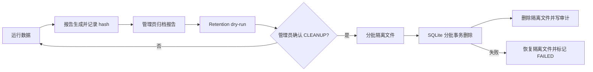

# 生产数据生命周期

## 2026-07-23 schema v4 与追溯闭环

数据库 schema 版本提升为 4：`test_sessions` 增加 serial/车型/工单/重复策略、duplicate source、release/config/DBC/plan hash 与 auth session；新增 `control_intents` 及状态/会话索引。迁移继续具备预备份、幂等、失败恢复和禁止旧程序打开新 schema 的边界。

session identity 贯穿 raw CAN、decoded signals、alarms、assertions、reports、print/history/export；无 active session 的 CAN 统一显示 `-`。retention preview/job 覆盖 raw、decoded、reports、exports、temp、backups 和 application logs，保护 active session、全部操作审计、未归档报告、已验证备份、restore rollback 与活动 quarantine。每批数据库删除和删除审计在同一事务；文件先隔离，事务/审计失败时恢复。默认仍只 dry-run/告警，实际删除要求管理员明确确认。

production 暂禁用现有全文件重写式 Parquet；当前批准路径是 append-only CSV，直到分区 writer 和百万级稳态完成验收。

更新日期：2026-07-22。本文件是 P1-06、P1-07、P1-08、P1-10、P1-11 的实现基线。

## 唯一数据根

运行时只接受 `RuntimeConfig.data_root` 作为持久化数据根。production 的值来自已签名 active configuration；数据库、日志或报告路径不能在系统设置中单独修改。固定布局版本为 1：

```text
<data_root>/
├─ database/chassis_eol.sqlite3
├─ logs/application/chassis-eol.log
├─ logs/raw_can/
├─ logs/decoded_signals/
├─ reports/
├─ exports/
│  ├─ history/
│  └─ report-archives/
├─ temp/
│  ├─ cleanup/
│  └─ manual-delete/
├─ backups/
│  ├─ migration/
│  └─ restore-rollbacks/
├─ print_jobs/
├─ auth/
└─ config/
```

`DataPaths` 会先规范化绝对路径，再派生固定子目录；禁止把文件系统盘符根作为 `data_root`，所有文件访问还会校验规范化后的路径仍在批准根目录内。路径可以包含空格和中文。

## 启动与持续健康检查

启动顺序为：规范化路径 → 创建固定目录 → 临时文件写入并 `fsync` → 查询剩余空间 → 打开 SQLite → migration → SQLite 写探针和 `integrity_check` → 初始化业务服务。`CHASSIS_MIN_FREE_BYTES` 默认 104857600（100 MiB）。

运行期每 5 秒重复目录写入、剩余空间、数据库写入和完整性检查。只读、磁盘不足、锁冲突、提交失败或数据库损坏会：

1. 设置 `state.db_writable=false`；
2. 保留 level 4 `storage_unhealthy` 系统告警；
3. 由现有 SafetyInterlock 拒绝新的运动控制；
4. 让当前持久化操作失败，不返回伪成功。

故障排除后必须由管理员调用 `POST /api/v1/storage/health/recheck`。只有路径、空间、写入和完整性全部通过才清除锁定告警。

## 数据状态机



未归档报告、`IDLE/RUNNING/PAUSED/WAITING_OPERATOR` 检测会话、全部 auth session 和全部 `operator_actions` 永久排除在自动候选之外。项目不再自动按文件 mtime 删除 Raw CAN；`auto_cleanup` 固定为 false。

dry-run 返回会话数、最早/最晚时间、各表行数、文件数、精确文件字节数和估算数据库字节数。执行任务使用 `QUEUED → RUNNING → COMPLETED/FAILED/CANCELLED`，支持查询进度和批次间取消。数据库批次失败时，已移入 `<data_root>/temp/cleanup/<job>` 的文件会恢复原位。

## 备份与恢复

备份使用 SQLite online backup API，不复制活动中的 WAL 文件。每个备份目录包含 `database.sqlite3` 和严格 pydantic manifest。manifest 记录：软件版本、schema version、DBC hash、配置版本、检测方案版本、文件大小和 SHA-256。

恢复流程：

1. admin 查询并验证 manifest、路径、文件大小、SHA-256 和 schema 上限；
2. 确认当前无活动 EOL 会话；
3. 输入精确确认文字 `RESTORE <backup_id>`；
4. 先对当前数据库创建 online rollback 副本；
5. 原子替换数据库并执行 `integrity_check`；
6. 对旧 schema 继续正式 migration；
7. 写入恢复完成审计并重新执行可写检查。

任何步骤失败均保持 `db_writable=false`；替换后失败会恢复 rollback 副本。未提供精确确认时绝不覆盖当前库。

## 权限与审计

查看容量和 schema 需要 viewer；备份、恢复、清理、健康复检和报告归档需要 admin；打印提交/取消/重试需要 operator。权限由后端 session principal 决定，前端按钮显示不构成授权。

以下操作使用强制数据库审计，审计写入失败时 API 不报告成功：备份创建、恢复开始/完成/拒绝、清理排队/取消/完成/失败、报告归档、打印排队/提交/状态变化/取消/重试、单文件 Raw CAN 删除。

## 明确边界

- 本轮验证仅使用 pytest 临时目录、SQLite 临时库和虚拟打印后端。
- 未读取或删除仓库已有 `data/` 或用户现场数据。
- 未连接真实 CAN、打印机或 Windows spooler。
- production 数据根 ACL、磁盘配额、备份介质、灾备 RTO/RPO 和物理打印结果仍需现场确认。
