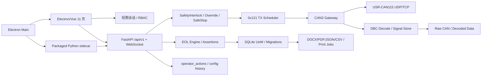

# 全项目完整审计

审计日期：2026-07-23（Asia/Shanghai）

## 1. 审计目标与口径

本轮以当前仓库实际代码为准，审查项目完整性、具体实现、11 个 Electron/Vue 页面、后端业务、CAN/DBC/安全、数据生命周期、报告打印、身份配置、安装发行与测试证据。历史审计只作为问题来源，不复用已经过期的低完成度结论。

完成度定义：

- 100%：实现、失败路径、权限、持久化/审计、文档、自动化和目标环境证据均闭环。
- 80%～99%：主链路完整，仍有现场验收、少量运维或次要交互缺口。
- 60%～79%：可用但有明显缺口，不应视为量产闭环。
- 40%～59%：部分实现或仅适合 Mock/实验室。
- 0%～39%：Stub、概念实现或缺少关键安全/真实环境证据。

“软件完成度”只评价仓库实现；“生产就绪度”同时要求可追溯发布、现场配置、硬件行为和运维证据。

## 2. 项目完整性总评

| 领域 | 当前状态 | 软件完成度 | 生产就绪度 |
|---|---|---:|---:|
| 架构与启动 | FastAPI sidecar、Vue renderer、Electron 主进程、Mock simulator 完整 | 92% | 65% |
| 身份、会话与 RBAC | 一次性 bootstrap、本地账户、短 session、锁定/撤销、路由与 API 双鉴权 | 92% | 72% |
| CAN/DBC | 严格 codec、UDP source allowlist、DBC hash/车型检查、Mock 充分 | 90% | 49% |
| 安全联锁与控制 | 依赖矩阵、fail-closed、override、safe-stop 软件状态机 | 92% | 32% |
| EOL 检测 | 12 步计划、断言引擎、会话状态机、报告生成 | 87% | 47% |
| 数据生命周期 | data_root、迁移、备份恢复、cleanup、健康联锁 | 88% | 62% |
| 报告与打印 | DOCX/PDF/JSON/CSV、hash、虚拟/Windows 打印状态机 | 88% | 54% |
| 11 页桌面 UI | 主要链路、中文化、状态稳定、双分辨率和权限闭环 | 90% | 68% |
| 安装与升级 | PyInstaller sidecar、NSIS、动态端口、SBOM/hash/manifest | 87% | 51% |
| 自动化与 CI | 后端/前端/模拟器/Electron/installer 分层验证 | 89% | 63% |

综合估算：软件功能 89%，生产部署 52%，真实车辆安全 28%。任何 P0 阻断项都优先于百分比。

## 3. 已形成的端到端架构

Electron 生产 renderer 使用本地 `loadFile` 和 hash 路由；`nodeIntegration=false`、`contextIsolation=true`、sandbox/webSecurity 开启，preload IPC 较小。sidecar 选择动态 localhost 端口，生成每次启动凭据，轮询 readiness，有界重启和优雅退出，默认 Mock/回环且不启动 simulator。

## 4. 已确认完成或接近完成的关键能力

### 4.1 安全联锁

- 普通非停车 0x121 命令至少依赖车速和前/后控制器心跳。
- 驱动、转向、制动只在命令涉及对应功能时追加依赖；EOL 检测要求全部反馈组。
- 每个反馈检查 present、age、quality、来源通道、CAN ID 和合理范围/允许值。
- missing、stale、invalid、out-of-range、来源错误、数据库不可写、急停、严重告警、队列异常均 fail-closed。
- 错误返回结构包含 rule、label、current、threshold、blocking，API 返回 409。
- override 具备申请/审批分离、作用域、有效期、撤销和过期；不能绕过急停、数据库不可写、关键反馈或 DBC 不匹配。
- safe-stop 先重试发送制动/零速命令，再等待新鲜速度与制动确认；确认后可配置停止发送或保持制动，但硬件验证默认 false。

### 4.2 CAN 与 DBC

- USR-CAN115 13 字节 codec 严格检查标准/扩展 ID、保留位、DLC、RTR 和长度。
- UDP 在解码、在线状态和信号缓存之前校验来源 IP/端口；非授权源只计数和告警。
- 接收队列和解码 pipeline 有容量、深度、丢弃与陈旧帧统计。
- 默认主动发送集合仍是 CAN2 的 `{0x121}`；0x123、0x126、0x710、0x715/NMT 未开放。
- production 强制签名配置、批准 DBC SHA-256、车型一致和 DBC ready；开发/Mock 显式标记退化数据来源。
- 当前随包 DBC 为 `Yunle_CAN_integrated_candb_jd.dbc`，SHA-256 为 `387ae48bd84852c8a6401653f96d1f7fca2a604c90fad018db800bf548ab468c`。

### 4.3 身份与配置

- 首次管理员由本机一次性 bootstrap secret 初始化，成功后凭据立即失效。
- 密码使用 scrypt 派生；session token 随机生成且数据库只存 hash，默认 900 秒。
- 登录失败限制默认 5 次、锁定 300 秒；支持登出、锁屏、过期、撤销。
- Vue Router 具有 authenticated/roles 元数据；后端 API 是权限真源；WebSocket 4401 后停止重连并要求重新登录。
- 敏感读 API 要求会话；健康探针只公开最小状态；写接口按 operator/engineer/admin 分层。
- 签名配置包支持 schema、版本、diff、dry-run、apply、健康检查、回滚和审计。

### 4.4 数据、报告与桌面发行

- SQLite、日志、原始 CAN、解码数据、报告、导出、临时和备份由唯一 data_root 派生。
- 启动检查路径规范化、可写性和最小剩余空间；数据库 schema 当前为 v3，迁移前备份并禁止降级打开新库。
- SQLite 在线备份、manifest/hash、恢复前后校验、回滚副本、管理员确认和审计已实现。
- cleanup 有 dry-run、保护规则、分批事务、进度、取消和失败状态。
- 报告支持 DOCX、原生 ReportLab PDF、JSON、CSV；PDF 不伪装为改扩展名文件。
- 打印支持虚拟后端测试以及 Windows spooler job id、完成/失败/取消/重试状态。
- Electron Builder + NSIS、PyInstaller onedir sidecar、SBOM、依赖审计、artifact SHA-256 和 release manifest 已实现。

## 5. 关键不完整实现与缺陷

### 5.1 P0：生产配置存在第二条未签名修改路径

`backend/app/api/config.py:903-974` 的 `PUT /config/channels` 在 production 也可执行。它直接构造 RuntimeConfig、重启 gateway 并替换 `configs/channels.yaml`，没有要求 `SignedConfigurationPackage`，也没有 production 的批准来源收帧健康等待。System Settings 的签名 import/apply 因此不是唯一配置权威。

同一路径在重建 `CanGatewayManager` 时没有传入 `on_can_security_event`，重新配置后未授权 UDP 来源仍会被丢弃和计数，但安全告警回调/持久化链路丢失。生产必须禁用该普通 endpoint 或令其只接受签名包；Network 页面在 production 应跳转到签名 dry-run/apply。

### 5.2 P0/P1：控制与操作审计不是原子闭环

`backend/app/services/audit.py` 捕获任意数据库异常后只写日志。`send-once` 和 `start-periodic` 是先发送/启动，再调用审计；因此可能出现“控制已执行、操作审计未落库”的状态。数据库不可写联锁能阻止已知的运动入口，但审计写入瞬时失败或发送后失败仍存在不可否认性缺口。

建议使用数据库中的 command intent/outbox：先在事务中写入 `PENDING`，提交后发送，再写 `SENT/FAILED/CONFIRMED`；若第二次落库失败，立即锁存数据故障并 safe-stop，不向 API 报告完整成功。安全拒绝也需要同样的可靠持久化或显式 fail-closed。

### 5.3 P0 外部：真实安全链未建立证据

仓库没有物理急停输入、安全 PLC/继电器、独立动力切断、控制器 watchdog 时序和 safe-stop 确认后行为的台架记录。`hardware_validated=false` 是正确默认值，但签名配置 schema 不包含经审批的硬件验收引用，因此系统目前没有受控的真实运动放行流程。

### 5.4 P1：追溯与运行元数据存在演示/固定值

- `CreateSessionRequest` 默认底盘号、VIN、序列号、操作员和工位，缺少生产格式、扫码/工单绑定和唯一性校验。
- `CanGatewayManager.latest_frames` 和前端 CAN store 均可能把来源会话写成 `S20260401-001`。
- System Settings 的配置版本固定 `cfg-20260401`，测试计划固定 `eol-plan-1.0.2`，Node 固定 `20.x`，构建时间用请求当前时间。
- DBC 未加载时仍显示默认文件名、hash、48 条报文和 312 个信号，可能把 unavailable 伪装为已知元数据。

这些问题不直接扩大 CAN 能力，但会破坏量产追溯、报告可信度和问题调查。

### 5.5 P1：TCP、运维和长期数据策略未完成

- TCP transport 只做一次 `open_connection`；EOF 后退出，没有 reconnect/backoff、半开探测、手动重连和生产状态机。
- 应用日志使用普通 `FileHandler`，没有大小/时间轮转和保留策略。
- `storage_config.yaml` 的 decoded/report/app log retention 没有形成自动作业；raw writer 的 `retention_days` 只是状态字段。
- `compress_rotated` 配置名与 lifecycle 读取的 `compress_after_days` 不一致，导致配置的压缩开关未生效。
- Parquet 追加会读取整个现有文件后重写，不适合大规模长期数据。
- production 的 `network_interface.adapter_name` 没有与 Windows 实际网卡身份绑定验证。

### 5.6 P1：发行证据不能覆盖当前工作树

当前 UI/后端有大量未提交修改。最新远程 Windows CI 通过的是较早提交 `df4d15f`；phase-06 安装包基于 `3c6c838` 加 209 个 dirty 文件，且为 `unsigned-internal`。因此现有 hash、SBOM 和安装证据不能作为当前工作树或正式发行版的供应链证明。

## 6. 文档完整性与漂移

当前文档覆盖架构、API、安全、CAN、配置、身份、数据、报告、部署、安装和测试，体系较完整；但存在下列漂移：

- `docs/audit/00`～`15` 中大量结论是早期 46% 左右的历史状态，不能再作为当前结论。
- `docs/IDENTITY_AND_ACCESS.md` 仍把已实现的数据生命周期列作“后续工作”。
- `configs/channels.yaml` 的 CAN1 `allow_tx: true` 虽不被当前 Pydantic 字段消费，但与“CAN1 禁止主动发送”的语义冲突，容易误导运维。
- `docs/TESTING.md` 开头的直接 pytest 命令没有突出隔离临时目录的统一质量脚本。
- UI 一致性文档是未提交文件，尚未获得当前 HEAD 的远程 CI 和发布证据。

## 7. 最终判定

- 开发启动：可以。
- Mock 完整联调：可以，且自动化证据充分。
- unsigned 内部 Windows 安装验证：可以，但必须标记内测、离线和非生产。
- 真实 CAN 只监听诊断：需先修复生产配置单一权威、完成批准来源配置，并在隔离台架执行；当前未放行。
- 真实底盘静态通电：需现场安全链和只监听验收；当前未放行。
- 真实车辆主动运动/EOL 生产：不可以。

后续顺序必须是：先关闭 P0 软件问题并形成干净提交/签名发行候选，再完成只监听台架、物理安全链和 safe-stop/watchdog 证据，最后才允许受控的低速运动台架验证。
